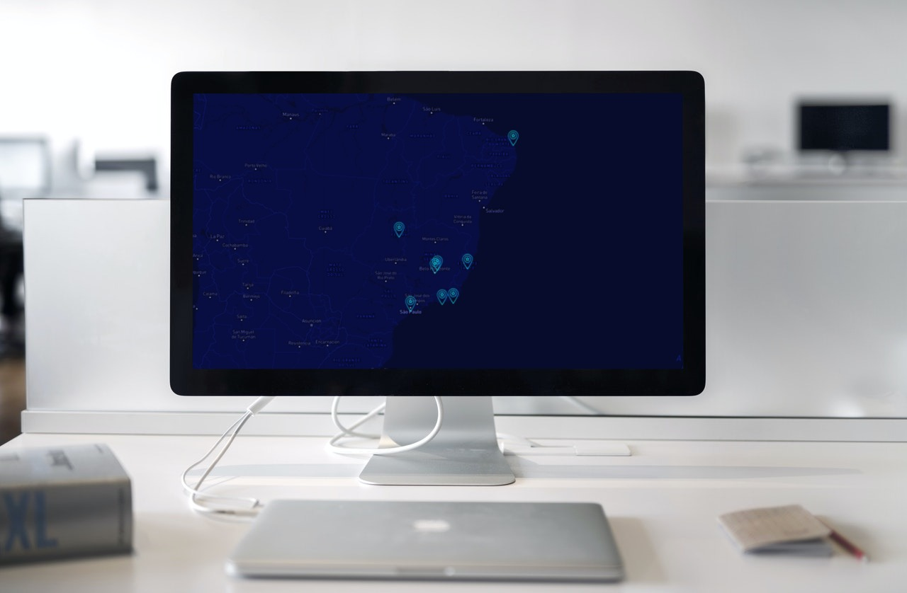

<h1 align="center">
    MyTrip
    <br/><br/>
</h1>

<p align="center">
  <a href="#sobre">Projeto</a>&nbsp;&nbsp;&nbsp;|&nbsp;&nbsp;&nbsp;
  <a href="#tecnologias">Tecnologias</a>&nbsp;&nbsp;&nbsp;|&nbsp;&nbsp;&nbsp;
  <a href="#setup">Setup</a>&nbsp;&nbsp;&nbsp;|&nbsp;&nbsp;&nbsp;
  <a href="#layout">Layout</a>&nbsp;&nbsp;&nbsp;|&nbsp;&nbsp;&nbsp;
  <a href="#licença">Licença</a>
</p>

<p align="center">
 

  
</p>

<br>

## Projeto

Projeto criado com NextJS: Projeto onde exibe pontos em um mapa, quando clicado ele mostrar mais informações e fotos.

## Tecnologias

Esse projeto foi desenvolvido com as seguintes tecnologias:

- [JavaScript](https://developer.mozilla.org/pt-BR/docs/Web/JavaScript)
- [React](https://reactjs.org)
- [TypeScript](https://www.typescriptlang.org)
- [Leaflet](https://leafletjs.com)
- [GraphCMS](https://graphcms.com)
- [NextJS](https://nextjs.org)
- [GraphQL](https://graphql.org)
- [Styled Components](https://styled-components.com)


## Setup

Clone o repositório em sua maquina:

`git clone https://github.com/BrunoLagoa/my-trips.git`

- Abra as pastas e execute `yarn` para instalar todas as dependencies

### **Frontend**

```bash
# Entre no repositório
$ cd my-trips

# Instale as dependências
$ yarn

# Execute a aplicação
$ yarn dev

# Será executado na port 3000
```

## Layout

<div align="center">
    
</div>

<br/><br/>

<p>Site publicado em:</p>
<a alt="Bruno Castro" target="_blank" rel="noopener noreferrer" href="https://my-trips.brunocastro.dev">Clique aqui para visualizar</a>

---

## Licença

Esse projeto está sob a licença MIT. Veja o arquivo [LICENSE](LICENSE.md) para mais detalhes.

---

<h3 align="center">
Autor: <a alt="Bruno Castro" href="https://brunocastro.dev">Bruno Castro</a>
</h3>

<p align="center">

  <a alt="Bruno Castro Linkedin" href="https://www.linkedin.com/in/brunovcastro">
    </a>
  <a alt="Bruno Castro GitHub" href="https://github.com/brunolagoa">
  </a>

</p>

<p>
  [](https://holopin.io/@brunolagoa)
</p>
